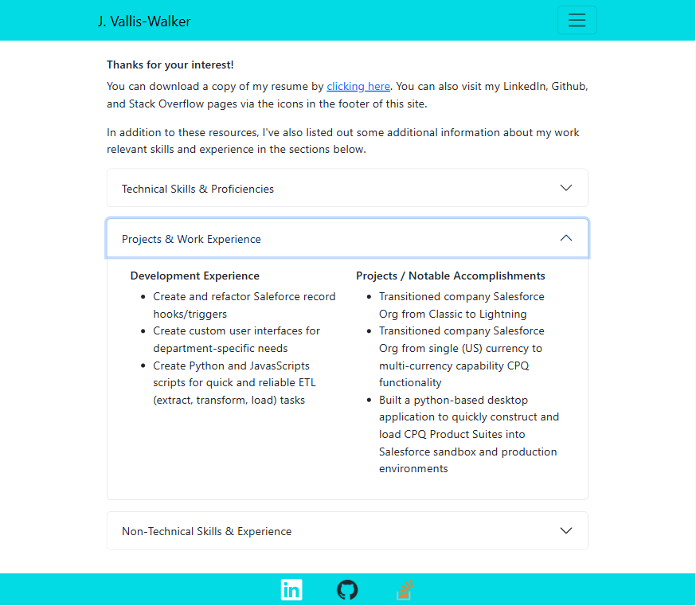

# C20: Jamil's Portfolio (2.0)

In this assignment, I create a personal portfolio site using React as the primary library. This site was designed with a mobile-first approach, and uses a front-end react server for site routing. Bootstrap was the primary css framework used, although custom modifications were made where needed.

## Application

You can visit this web app by [clicking here](https://jamils-portfolio.netlify.app/). Below are screenshots of the application at various media sizes.

<table>
<tr>
    <th>Mobile View</th>
    <th>Tablet View</th>
</tr>
<tr>
    <td width="29.7%" align="center">
        
    </td>
    <td >
        
    </td>
</tr>
<tr>
    <th colspan="2">Desktop View</th>
</tr>
<tr>
    <td colspan="2">
        
    </td>
</tr>
</table>

## Code Sources

Below is a list of outside sources I consulted for code reference/solutions when developing this site.

Navbar With Toggle

- https://react-bootstrap-v5.netlify.app/components/navbar/#navbars-overview

Bootstrap React Footer

- https://medium.com/@racosta323/create-a-simple-footer-using-react-bootstrap-58c4371a4ade

- https://react-bootstrap.netlify.app/docs/components/navbar/#sticky-top

useEffect for Window Width

- https://www.youtube.com/watch?v=0ZJgIjIuY7U&t=681s

useMediaQuery

- https://www.npmjs.com/package/react-responsive
- https://blog.logrocket.com/using-react-responsive-to-implement-responsive-design/

useOutletContext

- https://reactrouter.com/en/main/hooks/use-outlet-context

"for" input property in React

- https://stackoverflow.com/questions/22752116/react-ignores-for-attribute-of-the-label-element

Boostrap React Accordion

- https://react-bootstrap.netlify.app/docs/components/accordion/
